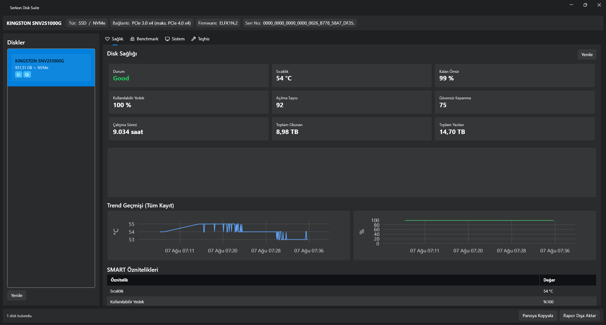

# Serkon Disk Suite

[](https://github.com/DoguuKaya/SerkonDiskSuite/actions/workflows/ci.yml)
[](https://github.com/DoguuKaya/SerkonDiskSuite/releases/latest)
[](LICENSE)
[](https://dotnet.microsoft.com/download/dotnet/8.0)

Windows için açık kaynak **disk sağlığı, benchmark ve izleme** uygulaması.
CrystalDiskInfo, CrystalDiskMark ve HWiNFO'nun ihtiyaç duyulan özelliklerini
tek bir native uygulamada toplar. .NET 8 + WPF ile yazılmıştır.

> Bu proje, tek bir M.2 NVMe SSD'yi bir PCIe adaptör kart üzerinden ikinci disk
> olarak kuran, ardından sağlığını ve performansını doğrulamak isteyen gerçek bir
> ihtiyaçtan doğdu. Kullanılan tüm araçların özelliklerini tek çatı altında topluyor.



## İndir

En son sürüm için **[GitHub Releases](https://github.com/DoguuKaya/SerkonDiskSuite/releases/latest)**
sayfasına gidin ve şu ikisinden birini indirin:

- **`SerkonDiskSuite-Setup-*.exe`** (önerilen) — kurulum sihirbazı; masaüstü/Başlat
  Menüsü kısayolu ve kaldırma seçeneği ekler.
- **`SerkonDiskSuite-*-win-x64.zip`** — taşınabilir tek dosya; içindeki
  `SerkonDiskSuite.exe`'yi istediğiniz yere çıkarıp doğrudan çalıştırın.

Her iki durumda da SMART disk sağlığı özellikleri için `smartctl.exe`'yi kendiniz
indirmeniz gerekir — bkz. [SMART aracı kurulumu](#smart-aracı-kurulumu) (lisans
nedeniyle pakete dahil edilmez; eksikse uygulama açılışta sizi bilgilendirir).

## Özellikler
- **Disk Sağlığı (SMART):** Sıcaklık, kalan ömür, açılma sayısı, güvensiz kapanma, tüm SMART öznitelikleri. NVMe ve SATA destekli.
- **Gerçek zamanlı sıcaklık grafiği** ve diskin tüm zamanlar trend geçmişi (sıcaklık + kalan ömür).
- **Teşhis:** SMART self-test başlatma (kısa/uzun) ve sonuçları, firmware sürümü, NVMe kritik uyarı bayrakları.
- **Benchmark:** Sıralı/rastgele okuma-yazma testi (MB/s ve IOPS), cache-bypass ile gerçekçi sonuçlar, hazır CrystalDiskMark profilleri (SEQ1M Q8T1, RND4K Q32T16 vb.) ve sıralı/rastgele için ayrı ayarlanabilir kuyruk derinliği (Q) / iş parçacığı (T).
- **Rapor dışa aktarma:** Disk + SMART + benchmark + o anki sistem (CPU/GPU/RAM) özetini metin/JSON olarak kaydetme veya panoya kopyalama.
- **Sistem Bilgisi:** İşletim sistemi, CPU, anakart, BIOS, RAM.
- **Gerçek zamanlı CPU/GPU/RAM izleme (HWiNFO'nun temel karşılığı):** CPU yük ve
  sıcaklık için ayrı canlı grafikler, GPU yük/sıcaklık/VRAM (varsa), RAM kullanımı;
  CPU/GPU trend geçmişi loglanır. Sıcaklık okunamayan sistemlerde (bkz.
  [Bilinen kısıtlar](#bilinen-kısıtlar)) VBS/Bellek Bütünlüğü tespit edilip
  kullanıcıya açıklayıcı bir mesaj gösterilir.
- **Modern koyu tema arayüz**, çoklu disk desteği.

## Gereksinimler
- Windows 10/11 (x64)
- Uygulama **yönetici olarak** çalışır (SMART/disk erişimi için gereklidir)
- **Opsiyonel:** SMART okuma için [smartmontools](https://www.smartmontools.org/) (`smartctl.exe`) —
  eksikse uygulama açılır ama SMART sağlık özellikleri devre dışı kalır
- Geliştirme için (kaynaktan derlemek isteyenler): [.NET 8 SDK](https://dotnet.microsoft.com/download/dotnet/8.0)

## SMART aracı kurulumu
1. [smartmontools](https://www.smartmontools.org/) indirin.
2. `smartctl.exe` ve beraberindeki DLL'leri, uygulamanın çalıştığı klasördeki
   (veya kaynaktan derliyorsanız proje kökündeki) `tools/` klasörüne kopyalayın.
   (Bu dosyalar GPL lisanslı olduğu için ne repoya ne de installer/zip'e dahil
   edilir; `.gitignore`'dadır, kullanıcı kendi indirir.)

## Kaynaktan derleme ve çalıştırma
```powershell
git clone https://github.com/DoguuKaya/SerkonDiskSuite.git
cd SerkonDiskSuite
dotnet restore
dotnet build
dotnet run --project src/SerkonDiskSuite.App
```

## Testler
```powershell
dotnet test
```

## Tek dosya (indirilebilir) exe üretme
```powershell
dotnet publish src/SerkonDiskSuite.App -c Release
```
Çıktı: `src/SerkonDiskSuite.App/bin/Release/net8.0-windows/win-x64/publish/SerkonDiskSuite.exe`

## Kurulum paketi (installer) oluşturma
[Inno Setup](https://jrsoftware.org/isinfo.php) kurulu olmalı. Önce yukarıdaki
`dotnet publish` adımını çalıştırın, ardından:
```powershell
ISCC /DAppVersion=1.0.0 installer\setup.iss
```
Çıktı: `installer\output\SerkonDiskSuite-Setup-1.0.0.exe`. Etiketli (`v*`) bir
sürüm push'landığında bu, GitHub Actions üzerinden otomatik üretilip
[Releases](https://github.com/DoguuKaya/SerkonDiskSuite/releases) sayfasına
yüklenir (bkz. `.github/workflows/release.yml`).

## Mimari
Katmanlı (Clean Architecture) yapı — ayrıntı için [`CLAUDE.md`](CLAUDE.md):

```
App (WPF/MVVM)  ->  Infrastructure (smartctl, WMI, benchmark)  ->  Core (domain, saf mantık)
```

## Bilinen kısıtlar
- **CPU/anakart sıcaklığı bazı sistemlerde okunamaz.** Windows 11'in Sanallaştırma Tabanlı
  Güvenlik (VBS) / Bellek Bütünlüğü (Memory Integrity) özelliği etkinken (Görev
  Yöneticisi'nde "Sanallaştırma: Etkin"), donanım izleme kütüphanesinin (LibreHardwareMonitor)
  kullandığı imzasız çekirdek sürücüsü sıcaklık kayıtlarına erişemez. Bu, Windows'un kasıtlı
  bir güvenlik sınırıdır — yönetici hakkı bile bunu aşamaz ve uygulamada düzeltilemez (bkz.
  [LibreHardwareMonitor issue #566](https://github.com/LibreHardwareMonitor/LibreHardwareMonitor/issues/566)).
  Uygulama VBS'in etkin olduğunu tespit edebilirse bunu açıklayan bir mesaj gösterir.
- Disk format/partition işlemleri ve firmware güncelleme desteklenmez (kapsam dışı, bkz. `CLAUDE.md`).

## Uyarı
Disk yönetimi/benchmark işlemleri diske yazma yapar. Benchmark, hedef sürücüde geçici
bir dosya oluşturup siler. Önemli verilerinizin yedeğini almanız önerilir.

## Lisans
MIT — bkz. [`LICENSE`](LICENSE).
smartmontools ayrı olarak GPL lisanslıdır ve bu depoya dahil edilmez.

## Katkıda bulunma
Issue ve pull request'ler açıktır. Katkıda bulunmadan önce:
- Kod stili ve mimari kararlar için [`CLAUDE.md`](CLAUDE.md)'ye bakın.
- `dotnet build` ve `dotnet test`'in hatasız/uyarısız geçtiğinden emin olun.
- Değişikliğinizi açıklayan kısa bir PR açıklaması yazın; UI değişikliklerinde
  mümkünse ekran görüntüsü ekleyin.

Yapılacaklar listesi `CLAUDE.md` içindedir.
